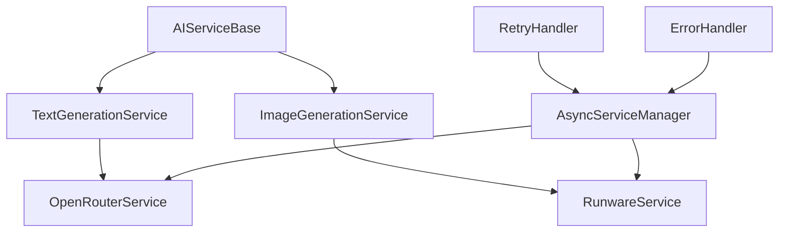

# ai_services.py - AI Service Integrations

## 📖 Overview

AI services integration module that provides async interfaces to external AI APIs for text generation and image creation. This module handles all communication with OpenRouter (for text generation) and Runware (for image generation) services.

## 🎯 Purpose

- **Text Generation**: Convert stories into structured scene descriptions
- **Image Generation**: Create visual content from text prompts
- **Async Operations**: Non-blocking API calls with concurrent processing
- **Error Handling**: Robust retry logic and fallback mechanisms

## 🚀 Key Features

### ✅ **Async/Await Support**
- Non-blocking API calls using aiohttp
- Concurrent processing of multiple requests
- Background task support for long operations
- Graceful fallback to synchronous operations

### ✅ **Retry Logic & Error Handling**
- Exponential backoff for failed requests
- Rate limit handling and respect
- Comprehensive error classification
- Automatic failover between service endpoints

### ✅ **Abstract Base Classes**
- Consistent interface across different AI services
- Easy to add new AI service providers
- Mockable for testing and development
- Type-safe service implementations

## 🏗️ Architecture

### Service Interface Design



### Abstract Base Classes

#### `AIServiceBase`
```python
class AIServiceBase(ABC):
    """Abstract base class for all AI services"""
    
    def __init__(self, api_config: APIConfig):
        self.config = api_config
        self.session = None  # Will be aiohttp.ClientSession
        self.retry_handler = RetryHandler(
            max_attempts=api_config.retry_attempts,
            base_delay=1.0,
            max_delay=60.0
        )
    
    @abstractmethod
    async def initialize(self) -> bool:
        """Initialize service connection"""
        pass
    
    @abstractmethod
    async def test_connection(self) -> bool:
        """Test if service is available"""
        pass
    
    @abstractmethod
    async def close(self) -> None:
        """Clean up resources"""
        pass
    
    def is_available(self) -> bool:
        """Check if service is properly configured"""
        return self.config.is_configured()
```

#### `TextGenerationService`
```python
class TextGenerationService(AIServiceBase):
    """Base class for text generation services"""
    
    @abstractmethod
    async def generate_scene_analysis(
        self, 
        story_text: str, 
        num_scenes: int
    ) -> ScriptAnalysis:
        """Analyze story and return structured analysis"""
        pass
    
    @abstractmethod
    async def generate_scenes(
        self, 
        story_text: str, 
        num_scenes: int,
        media_type: MediaType
    ) -> List[ScenePrompt]:
        """Generate scene prompts from story text"""
        pass
    
    @abstractmethod
    async def enhance_scene_prompt(
        self, 
        scene: ScenePrompt,
        context: Dict[str, Any]
    ) -> ScenePrompt:
        """Enhance existing scene prompt with additional context"""
        pass
```

#### `ImageGenerationService`
```python
class ImageGenerationService(AIServiceBase):
    """Base class for image generation services"""
    
    @abstractmethod
    async def generate_image(
        self, 
        prompt: str,
        style: MediaType,
        **kwargs
    ) -> str:
        """Generate single image from prompt, returns URL"""
        pass
    
    @abstractmethod
    async def generate_images_batch(
        self, 
        prompts: List[str],
        style: MediaType,
        **kwargs
    ) -> List[str]:
        """Generate multiple images concurrently"""
        pass
    
    @abstractmethod
    async def get_generation_status(self, request_id: str) -> Dict[str, Any]:
        """Check status of image generation request"""
        pass
```

## 🤖 OpenRouter Service Implementation

### `OpenRouterService`
```python
class OpenRouterService(TextGenerationService):
    """OpenRouter API integration for text generation"""
    
    def __init__(self, api_config: APIConfig):
        super().__init__(api_config)
        self.base_url = "https://openrouter.ai/api/v1"
        self.model = "anthropic/claude-3-sonnet"  # Default model
        self.headers = {
            "Authorization": f"Bearer {api_config.api_key}",
            "Content-Type": "application/json",
            "HTTP-Referer": "https://your-app.com",
            "X-Title": "Story to Image Generator"
        }
    
    async def initialize(self) -> bool:
        """Initialize OpenRouter service"""
        try:
            connector = aiohttp.TCPConnector(limit=10, limit_per_host=5)
            timeout = aiohttp.ClientTimeout(total=self.config.timeout)
            
            self.session = aiohttp.ClientSession(
                connector=connector,
                timeout=timeout,
                headers=self.headers
            )
            
            # Test connection
            is_available = await self.test_connection()
            
            logger.info(f"✅ OpenRouter service initialized: {is_available}")
            return is_available
            
        except Exception as e:
            logger.error(f"❌ Failed to initialize OpenRouter: {e}")
            return False
    
    async def test_connection(self) -> bool:
        """Test OpenRouter API connectivity"""
        try:
            async with self.session.get(f"{self.base_url}/models") as response:
                if response.status == 200:
                    models = await response.json()
                    logger.info(f"✅ OpenRouter connected - {len(models.get('data', []))} models available")
                    return True
                else:
                    logger.warning(f"⚠️ OpenRouter responded with status {response.status}")
                    return False
                    
        except Exception as e:
            logger.error(f"❌ OpenRouter connection test failed: {e}")
            return False
    
    async def generate_scene_analysis(
        self, 
        story_text: str, 
        num_scenes: int
    ) -> ScriptAnalysis:
        """Generate structured story analysis using OpenRouter"""
        
        prompt = self._create_analysis_prompt(story_text, num_scenes)
        
        try:
            response = await self._make_completion_request(prompt)
            analysis_data = self._parse_analysis_response(response)
            
            return ScriptAnalysis(**analysis_data)
            
        except Exception as e:
            logger.error(f"❌ Scene analysis failed: {e}")
            # Fallback to basic analysis
            return self._create_fallback_analysis(story_text, num_scenes)
    
    async def generate_scenes(
        self, 
        story_text: str, 
        num_scenes: int,
        media_type: MediaType
    ) -> List[ScenePrompt]:
        """Generate scene prompts from story using OpenRouter"""
        
        prompt = self._create_scene_generation_prompt(story_text, num_scenes, media_type)
        
        try:
            response = await self._make_completion_request(prompt)
            scenes_data = self._parse_scenes_response(response)
            
            scenes = []
            for i, scene_data in enumerate(scenes_data):
                scene = ScenePrompt(
                    scene_number=i,
                    title=scene_data.get('title', f'Scene {i+1}'),
                    description=scene_data.get('description', ''),
                    image_prompt=scene_data.get('image_prompt', '')
                )
                scenes.append(scene)
            
            logger.info(f"✅ Generated {len(scenes)} scenes using OpenRouter")
            return scenes
            
        except Exception as e:
            logger.error(f"❌ Scene generation failed: {e}")
            # Fallback to utility-based scene extraction
            from utils import extract_scenes_from_story
            return extract_scenes_from_story(story_text, num_scenes)
    
    async def _make_completion_request(self, prompt: str) -> str:
        """Make completion request to OpenRouter with retry logic"""
        
        request_data = {
            "model": self.model,
            "messages": [
                {
                    "role": "system", 
                    "content": "You are an expert story analyst and scene generator."
                },
                {
                    "role": "user", 
                    "content": prompt
                }
            ],
            "max_tokens": 2000,
            "temperature": 0.7,
            "top_p": 0.9
        }
        
        async def make_request():
            async with self.session.post(
                f"{self.base_url}/chat/completions",
                json=request_data
            ) as response:
                response.raise_for_status()
                result = await response.json()
                
                if 'choices' in result and len(result['choices']) > 0:
                    return result['choices'][0]['message']['content']
                else:
                    raise ValueError("Invalid response format from OpenRouter")
        
        return await self.retry_handler.execute_with_retry(make_request)
    
    def _create_analysis_prompt(self, story_text: str, num_scenes: int) -> str:
        """Create prompt for story analysis"""
        return f"""
Analyze this story and provide structured information in JSON format:

STORY:
{story_text}

Please analyze the story and return a JSON object with these fields:
- total_words: number of words in the story
- total_sentences: estimated number of sentences
- total_paragraphs: number of paragraphs
- estimated_scenes: recommended number of scenes (max {num_scenes})
- main_themes: array of 3-5 main themes
- key_characters: array of main character names
- primary_locations: array of important locations
- complexity_score: score from 1-10 for story complexity
- recommended_scenes: optimal number of scenes for this story

Return only valid JSON without additional text.
"""
    
    def _create_scene_generation_prompt(
        self, 
        story_text: str, 
        num_scenes: int, 
        media_type: MediaType
    ) -> str:
        """Create prompt for scene generation"""
        
        style_instructions = {
            MediaType.CINEMATIC: "dramatic, movie-like scenes with cinematic composition",
            MediaType.CARTOON: "animated, colorful, stylized cartoon scenes",
            MediaType.REALISTIC: "photorealistic, natural, documentary-style scenes"
        }
        
        style_desc = style_instructions.get(media_type, "visually appealing")
        
        return f"""
Break this story into exactly {num_scenes} visual scenes for {style_desc} image generation.

STORY:
{story_text}

For each scene, provide:
1. A descriptive title (max 50 chars)
2. A detailed scene description (100-200 words)
3. An optimized image generation prompt (focus on visual elements, composition, lighting, style)

Return as JSON array with objects containing: title, description, image_prompt

Example format:
[
  {{
    "title": "Hero's Journey Begins",
    "description": "The protagonist stands at the threshold...",
    "image_prompt": "A brave hero at castle gates, dramatic lighting, {style_desc}, high quality"
  }}
]

Generate exactly {num_scenes} scenes. Return only valid JSON.
"""
```

## 🎨 Runware Service Implementation

### `RunwareService`
```python
class RunwareService(ImageGenerationService):
    """Runware API integration for image generation"""
    
    def __init__(self, api_config: APIConfig):
        super().__init__(api_config)
        self.base_url = "https://api.runware.ai/v1"
        self.headers = {
            "Authorization": f"Bearer {api_config.api_key}",
            "Content-Type": "application/json"
        }
        self.active_requests = {}  # Track ongoing requests
    
    async def initialize(self) -> bool:
        """Initialize Runware service"""
        try:
            connector = aiohttp.TCPConnector(limit=20, limit_per_host=10)
            timeout = aiohttp.ClientTimeout(total=self.config.timeout * 2)  # Longer timeout for images
            
            self.session = aiohttp.ClientSession(
                connector=connector,
                timeout=timeout,
                headers=self.headers
            )
            
            is_available = await self.test_connection()
            logger.info(f"✅ Runware service initialized: {is_available}")
            return is_available
            
        except Exception as e:
            logger.error(f"❌ Failed to initialize Runware: {e}")
            return False
    
    async def test_connection(self) -> bool:
        """Test Runware API connectivity"""
        try:
            # Test with a simple status check
            async with self.session.get(f"{self.base_url}/status") as response:
                if response.status == 200:
                    logger.info("✅ Runware service is available")
                    return True
                else:
                    logger.warning(f"⚠️ Runware status check returned {response.status}")
                    return False
                    
        except Exception as e:
            logger.error(f"❌ Runware connection test failed: {e}")
            return False
    
    async def generate_image(
        self, 
        prompt: str,
        style: MediaType,
        **kwargs
    ) -> str:
        """Generate single image from prompt"""
        
        try:
            request_data = self._prepare_image_request(prompt, style, **kwargs)
            
            # Submit generation request
            async with self.session.post(
                f"{self.base_url}/generate",
                json=request_data
            ) as response:
                response.raise_for_status()
                result = await response.json()
                
                request_id = result.get('request_id')
                if not request_id:
                    raise ValueError("No request ID returned from Runware")
                
                # Poll for completion
                image_url = await self._wait_for_completion(request_id)
                
                logger.info(f"✅ Generated image: {image_url}")
                return image_url
                
        except Exception as e:
            logger.error(f"❌ Image generation failed: {e}")
            raise ImageGenerationError(f"Failed to generate image: {e}")
    
    async def generate_images_batch(
        self, 
        prompts: List[str],
        style: MediaType,
        **kwargs
    ) -> List[str]:
        """Generate multiple images concurrently"""
        
        if not prompts:
            return []
        
        logger.info(f"🎨 Starting batch generation of {len(prompts)} images")
        
        # Create tasks for concurrent generation
        tasks = []
        for i, prompt in enumerate(prompts):
            task = asyncio.create_task(
                self.generate_image(prompt, style, **kwargs),
                name=f"image_gen_{i}"
            )
            tasks.append(task)
        
        # Wait for all images to complete
        try:
            results = await asyncio.gather(*tasks, return_exceptions=True)
            
            # Process results
            image_urls = []
            successful = 0
            
            for i, result in enumerate(results):
                if isinstance(result, Exception):
                    logger.error(f"❌ Image {i} generation failed: {result}")
                    image_urls.append(None)
                else:
                    image_urls.append(result)
                    successful += 1
            
            logger.info(f"✅ Batch generation completed: {successful}/{len(prompts)} successful")
            return image_urls
            
        except Exception as e:
            logger.error(f"❌ Batch generation failed: {e}")
            return [None] * len(prompts)
    
    def _prepare_image_request(
        self, 
        prompt: str, 
        style: MediaType,
        **kwargs
    ) -> Dict[str, Any]:
        """Prepare image generation request data"""
        
        # Base request configuration
        request_data = {
            "prompt": prompt,
            "negative_prompt": "blurry, low quality, distorted, ugly, bad anatomy",
            "width": kwargs.get('width', 1024),
            "height": kwargs.get('height', 1024),
            "steps": kwargs.get('steps', 25),
            "cfg_scale": kwargs.get('cfg_scale', 7.5),
            "sampler": kwargs.get('sampler', 'euler_a'),
            "seed": kwargs.get('seed', -1)  # Random seed
        }
        
        # Style-specific adjustments
        style_configs = {
            MediaType.CINEMATIC: {
                "cfg_scale": 8.0,
                "steps": 30,
                "style_preset": "cinematic"
            },
            MediaType.CARTOON: {
                "cfg_scale": 6.0,
                "steps": 20,
                "style_preset": "anime"
            },
            MediaType.REALISTIC: {
                "cfg_scale": 7.5,
                "steps": 25,
                "style_preset": "photographic"
            }
        }
        
        if style in style_configs:
            request_data.update(style_configs[style])
        
        return request_data
    
    async def _wait_for_completion(
        self, 
        request_id: str, 
        max_wait_time: int = 300
    ) -> str:
        """Wait for image generation to complete"""
        
        start_time = time.time()
        poll_interval = 2.0  # Start with 2 second intervals
        
        while time.time() - start_time < max_wait_time:
            try:
                status = await self.get_generation_status(request_id)
                
                if status['status'] == 'completed':
                    image_url = status.get('image_url')
                    if image_url:
                        return image_url
                    else:
                        raise ValueError("Completion status but no image URL")
                
                elif status['status'] == 'failed':
                    error_msg = status.get('error', 'Unknown error')
                    raise ImageGenerationError(f"Generation failed: {error_msg}")
                
                elif status['status'] in ['pending', 'processing']:
                    # Still processing, wait and check again
                    await asyncio.sleep(poll_interval)
                    # Gradually increase poll interval to reduce API calls
                    poll_interval = min(poll_interval * 1.1, 10.0)
                    continue
                
                else:
                    raise ValueError(f"Unknown status: {status['status']}")
                
            except asyncio.TimeoutError:
                logger.warning(f"⚠️ Timeout polling status for request {request_id}")
                await asyncio.sleep(poll_interval)
                continue
            
            except Exception as e:
                logger.error(f"❌ Error polling status: {e}")
                await asyncio.sleep(poll_interval)
                continue
        
        # Timeout reached
        raise ImageGenerationError(f"Image generation timeout after {max_wait_time}s")
    
    async def get_generation_status(self, request_id: str) -> Dict[str, Any]:
        """Get status of image generation request"""
        
        try:
            async with self.session.get(
                f"{self.base_url}/status/{request_id}"
            ) as response:
                response.raise_for_status()
                return await response.json()
                
        except Exception as e:
            logger.error(f"❌ Failed to get generation status: {e}")
            return {"status": "error", "error": str(e)}
```

## 🔄 Service Manager

### `AsyncServiceManager`
```python
class AsyncServiceManager:
    """Manages all AI services and provides unified interface"""
    
    def __init__(self):
        self.text_service: Optional[TextGenerationService] = None
        self.image_service: Optional[ImageGenerationService] = None
        self.initialized = False
        self._lock = asyncio.Lock()
    
    async def initialize(self) -> bool:
        """Initialize all AI services"""
        async with self._lock:
            if self.initialized:
                return True
            
            try:
                # Initialize text generation service
                if config.openrouter.is_configured():
                    self.text_service = OpenRouterService(config.openrouter)
                    await self.text_service.initialize()
                
                # Initialize image generation service
                if config.runware.is_configured():
                    self.image_service = RunwareService(config.runware)
                    await self.image_service.initialize()
                
                self.initialized = True
                logger.info("✅ All AI services initialized successfully")
                return True
                
            except Exception as e:
                logger.error(f"❌ Failed to initialize AI services: {e}")
                return False
    
    async def generate_story_scenes(
        self, 
        story_text: str, 
        num_scenes: int,
        media_type: MediaType
    ) -> List[ScenePrompt]:
        """Generate scenes using text service with fallback"""
        
        if not self.initialized:
            await self.initialize()
        
        if self.text_service:
            try:
                return await self.text_service.generate_scenes(
                    story_text, num_scenes, media_type
                )
            except Exception as e:
                logger.warning(f"⚠️ Text service failed, using fallback: {e}")
        
        # Fallback to utility functions
        from utils import extract_scenes_from_story
        return extract_scenes_from_story(story_text, num_scenes)
    
    async def generate_scene_images(
        self, 
        scenes: List[ScenePrompt],
        media_type: MediaType
    ) -> List[ScenePrompt]:
        """Generate images for all scenes concurrently"""
        
        if not self.initialized:
            await self.initialize()
        
        if not self.image_service:
            logger.warning("⚠️ No image service available")
            return scenes
        
        # Extract prompts for batch generation
        prompts = [scene.image_prompt for scene in scenes]
        
        try:
            # Generate all images concurrently
            image_urls = await self.image_service.generate_images_batch(
                prompts, media_type
            )
            
            # Update scenes with image URLs
            for i, (scene, image_url) in enumerate(zip(scenes, image_urls)):
                if image_url:
                    scene.image_url = image_url
                    logger.info(f"✅ Scene {i} image generated: {image_url}")
                else:
                    logger.warning(f"⚠️ Scene {i} image generation failed")
            
            return scenes
            
        except Exception as e:
            logger.error(f"❌ Batch image generation failed: {e}")
            return scenes
    
    async def download_scene_images(
        self, 
        scenes: List[ScenePrompt],
        project_dir: str
    ) -> List[ScenePrompt]:
        """Download images for approved scenes"""
        
        download_tasks = []
        images_dir = Path(project_dir) / 'images'
        images_dir.mkdir(parents=True, exist_ok=True)
        
        for scene in scenes:
            if scene.image_url and not scene.image_path:
                task = asyncio.create_task(
                    self._download_single_image(scene, images_dir),
                    name=f"download_scene_{scene.scene_number}"
                )
                download_tasks.append(task)
        
        if download_tasks:
            logger.info(f"📥 Starting download of {len(download_tasks)} images")
            
            try:
                # Wait for all downloads to complete
                await asyncio.gather(*download_tasks, return_exceptions=True)
                
                # Count successful downloads
                successful = sum(1 for scene in scenes if scene.image_path)
                logger.info(f"✅ Downloaded {successful}/{len(download_tasks)} images")
                
            except Exception as e:
                logger.error(f"❌ Image download batch failed: {e}")
        
        return scenes
    
    async def _download_single_image(
        self, 
        scene: ScenePrompt, 
        images_dir: Path
    ) -> None:
        """Download a single scene image"""
        
        try:
            filename = f"scene_{scene.scene_number}.jpg"
            file_path = images_dir / filename
            
            # Download image data
            async with aiohttp.ClientSession() as session:
                async with session.get(scene.image_url) as response:
                    response.raise_for_status()
                    
                    # Save image data
                    with open(file_path, 'wb') as f:
                        async for chunk in response.content.iter_chunked(8192):
                            f.write(chunk)
            
            # Update scene with local path
            scene.image_path = str(file_path)
            logger.info(f"✅ Downloaded scene {scene.scene_number} image: {file_path}")
            
        except Exception as e:
            logger.error(f"❌ Failed to download scene {scene.scene_number} image: {e}")
    
    async def health_check(self) -> Dict[str, str]:
        """Check health of all AI services"""
        
        health_status = {}
        
        if self.text_service:
            try:
                is_available = await self.text_service.test_connection()
                health_status['text_service'] = 'available' if is_available else 'unavailable'
            except Exception:
                health_status['text_service'] = 'error'
        else:
            health_status['text_service'] = 'not_configured'
        
        if self.image_service:
            try:
                is_available = await self.image_service.test_connection()
                health_status['image_service'] = 'available' if is_available else 'unavailable'
            except Exception:
                health_status['image_service'] = 'error'
        else:
            health_status['image_service'] = 'not_configured'
        
        return health_status
    
    async def close(self) -> None:
        """Clean up all service connections"""
        
        if self.text_service:
            await self.text_service.close()
        
        if self.image_service:
            await self.image_service.close()
        
        self.initialized = False
        logger.info("✅ All AI services closed")

# Global service manager instance
service_manager = AsyncServiceManager()
```

## 🔄 Retry Handler

### `RetryHandler`
```python
class RetryHandler:
    """Handles retry logic with exponential backoff"""
    
    def __init__(
        self, 
        max_attempts: int = 3,
        base_delay: float = 1.0,
        max_delay: float = 60.0,
        backoff_factor: float = 2.0
    ):
        self.max_attempts = max_attempts
        self.base_delay = base_delay
        self.max_delay = max_delay
        self.backoff_factor = backoff_factor
    
    async def execute_with_retry(
        self, 
        operation: Callable,
        *args, 
        **kwargs
    ) -> Any:
        """Execute operation with retry logic"""
        
        last_exception = None
        
        for attempt in range(self.max_attempts):
            try:
                if asyncio.iscoroutinefunction(operation):
                    return await operation(*args, **kwargs)
                else:
                    return operation(*args, **kwargs)
                    
            except Exception as e:
                last_exception = e
                
                # Don't retry on certain errors
                if self._is_non_retryable(e):
                    logger.error(f"❌ Non-retryable error: {e}")
                    raise e
                
                # Calculate delay for next attempt
                if attempt < self.max_attempts - 1:
                    delay = min(
                        self.base_delay * (self.backoff_factor ** attempt),
                        self.max_delay
                    )
                    
                    logger.warning(
                        f"⚠️ Attempt {attempt + 1}/{self.max_attempts} failed: {e}. "
                        f"Retrying in {delay:.1f}s"
                    )
                    
                    await asyncio.sleep(delay)
                else:
                    logger.error(f"❌ All {self.max_attempts} attempts failed")
        
        # All attempts failed
        raise last_exception
    
    def _is_non_retryable(self, exception: Exception) -> bool:
        """Check if error should not be retried"""
        
        non_retryable_errors = [
            ValueError,          # Bad input data
            TypeError,          # Programming errors
            KeyError,           # Missing required fields
            ValidationError     # Data validation errors
        ]
        
        # HTTP status codes that shouldn't be retried
        if hasattr(exception, 'status'):
            non_retryable_status = [400, 401, 403, 404, 422]  # Client errors
            if exception.status in non_retryable_status:
                return True
        
        return any(isinstance(exception, error_type) for error_type in non_retryable_errors)
```

## 🧪 Testing Support

### Mock Services for Testing
```python
class MockTextService(TextGenerationService):
    """Mock text service for testing"""
    
    async def initialize(self) -> bool:
        return True
    
    async def test_connection(self) -> bool:
        return True
    
    async def close(self) -> None:
        pass
    
    async def generate_scenes(
        self, 
        story_text: str, 
        num_scenes: int,
        media_type: MediaType
    ) -> List[ScenePrompt]:
        """Generate mock scenes for testing"""
        
        scenes = []
        for i in range(num_scenes):
            scene = ScenePrompt(
                scene_number=i,
                title=f"Test Scene {i+1}",
                description=f"Mock description for scene {i+1}",
                image_prompt=f"Mock image prompt for scene {i+1}, {media_type} style"
            )
            scenes.append(scene)
        
        return scenes

class MockImageService(ImageGenerationService):
    """Mock image service for testing"""
    
    async def initialize(self) -> bool:
        return True
    
    async def test_connection(self) -> bool:
        return True
    
    async def close(self) -> None:
        pass
    
    async def generate_image(
        self, 
        prompt: str,
        style: MediaType,
        **kwargs
    ) -> str:
        """Return mock image URL"""
        return f"https://mock-api.com/images/test_{hash(prompt) % 10000}.jpg"
    
    async def generate_images_batch(
        self, 
        prompts: List[str],
        style: MediaType,
        **kwargs
    ) -> List[str]:
        """Return mock image URLs for batch"""
        return [await self.generate_image(p, style, **kwargs) for p in prompts]
```

## 📊 Error Handling

### Custom Exceptions
```python
class AIServiceError(Exception):
    """Base exception for AI service errors"""
    pass

class TextGenerationError(AIServiceError):
    """Exception for text generation errors"""
    pass

class ImageGenerationError(AIServiceError):
    """Exception for image generation errors"""
    pass

class ServiceInitializationError(AIServiceError):
    """Exception for service initialization errors"""
    pass

class RateLimitError(AIServiceError):
    """Exception for rate limit errors"""
    pass
```

## 📈 Performance Monitoring

### Request Timing
```python
async def monitor_request_performance(operation_name: str, operation: Callable) -> Any:
    """Monitor and log performance of AI service operations"""
    
    start_time = time.time()
    try:
        result = await operation()
        duration = time.time() - start_time
        logger.info(f"⏱️ {operation_name} completed in {duration:.2f}s")
        return result
    except Exception as e:
        duration = time.time() - start_time
        logger.error(f"❌ {operation_name} failed after {duration:.2f}s: {e}")
        raise
```

---

**ai_services.py provides robust, async, and scalable AI service integrations that handle both text generation and image creation with comprehensive error handling and retry logic! 🤖**