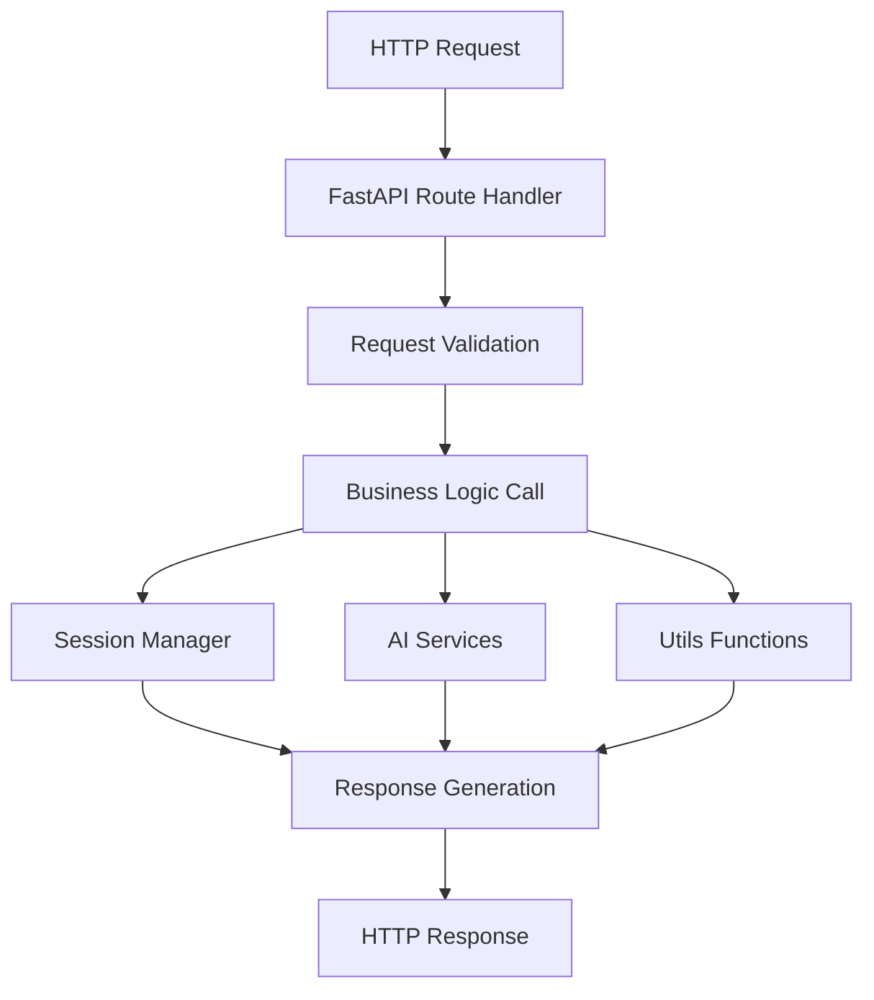

# main.py - FastAPI Application Entry Point

## 📖 Overview

The main FastAPI application that handles HTTP requests and coordinates all backend operations. This module serves as the entry point and API gateway for the Story to Image Generator.

## 🎯 Purpose

- **API Gateway**: Handles all HTTP requests and responses
- **Route Definition**: Defines all API endpoints
- **Middleware Setup**: Configures CORS and static file serving
- **Application Lifecycle**: Manages startup and shutdown processes

## 🚀 Key Features

### ✅ **RESTful API Endpoints**
- Story generation workflow endpoints
- Session management and status checking
- File download and approval endpoints
- Debug and health monitoring endpoints

### ✅ **CORS Support**
- Cross-origin resource sharing configuration
- Frontend integration ready
- Configurable allowed origins

### ✅ **Static File Serving**
- Generated images and projects served statically
- Automatic directory creation
- Efficient file serving with FastAPI

### ✅ **Error Handling**
- Comprehensive HTTP exception handling
- User-friendly error messages
- Debug information in development mode

## 📊 API Endpoints

### Core Generation Endpoints

#### `POST /generate`
**Purpose**: Start a new story generation process
```python
# Request Body
{
    "story_text": "Your story content...",
    "media_type": "cinematic",  # cinematic|cartoon|realistic
    "num_scenes": 5
}

# Response
{
    "session_id": "uuid-string",
    "status": "processing",
    "message": "Generation started"
}
```

#### `GET /status/{session_id}`
**Purpose**: Check the status of a generation session
```python
# Response
{
    "session_id": "uuid-string",
    "status": "completed",  # processing|completed|failed
    "progress": {
        "current_step": 3,
        "total_steps": 5,
        "description": "Generating images..."
    },
    "scenes": [...],  # Generated scenes data
    "error": null
}
```

#### `POST /approve`
**Purpose**: Approve generated scenes and trigger image downloads
```python
# Request Body
{
    "session_id": "uuid-string",
    "approved_scenes": [0, 1, 2]  # Scene indices to approve
}

# Response
{
    "message": "Images approved and downloading",
    "download_status": "started"
}
```

#### `POST /download`
**Purpose**: Download generated project files
```python
# Request Body (Form Data)
session_id: "uuid-string"

# Response
# ZIP file download with all generated content
```

### Management Endpoints

#### `GET /health`
**Purpose**: Service health check and status
```python
# Response
{
    "status": "healthy",
    "timestamp": "2025-01-15T10:30:00Z",
    "version": "3.0.0",
    "services": {
        "openrouter": "available",
        "runware": "available"
    },
    "active_sessions": 3,
    "uptime_seconds": 3600
}
```

#### `GET /debug/sessions` *(Debug Only)*
**Purpose**: View all active sessions
```python
# Response
{
    "active_sessions": 3,
    "sessions": [
        {
            "session_id": "uuid-1",
            "status": "processing",
            "created_at": "2025-01-15T10:00:00Z",
            "last_accessed": "2025-01-15T10:30:00Z"
        }
    ]
}
```

#### `GET /debug/config` *(Debug Only)*
**Purpose**: View configuration status
```python
# Response
{
    "api_keys": {
        "openrouter": "configured",
        "runware": "configured"
    },
    "directories": {
        "image_generation": "exists",
        "static_files": "exists"
    },
    "environment": "development"
}
```

## 🏗️ Application Structure

### Factory Pattern
```python
def create_app() -> FastAPI:
    """Factory function to create FastAPI app"""
    app = FastAPI(
        title="Story to Image Generator",
        description="Convert stories into visual scenes using AI",
        version="3.0.0"
    )
    
    # Configure middleware
    setup_cors(app)
    setup_static_files(app)
    
    # Register routes
    register_routes(app)
    
    return app
```

### Middleware Configuration
```python
# CORS Middleware
app.add_middleware(
    CORSMiddleware,
    allow_origins=["*"],  # Configure based on environment
    allow_credentials=True,
    allow_methods=["*"],
    allow_headers=["*"],
)

# Static Files
app.mount("/static", StaticFiles(directory="image_generation"), name="static")
```

## 🔄 Request Processing Flow



## 🛡️ Error Handling

### HTTP Exception Handling
```python
@app.exception_handler(HTTPException)
async def http_exception_handler(request: Request, exc: HTTPException):
    return JSONResponse(
        status_code=exc.status_code,
        content={
            "error": exc.detail,
            "status_code": exc.status_code,
            "timestamp": datetime.utcnow().isoformat()
        }
    )
```

### Common Error Responses
- **400 Bad Request**: Invalid input data
- **404 Not Found**: Session not found
- **500 Internal Server Error**: Server processing errors
- **503 Service Unavailable**: AI services unavailable

## 📝 Background Tasks

### Async Operations
```python
@app.post("/approve")
async def approve_scenes(
    request: ApprovalRequest,
    background_tasks: BackgroundTasks
):
    # Start background image downloading
    background_tasks.add_task(
        download_approved_images,
        request.session_id,
        request.approved_scenes
    )
    
    return {"message": "Download started"}
```

## 🔧 Development Features

### Auto-Reload Support
```python
if __name__ == "__main__":
    import uvicorn
    uvicorn.run(
        "main:app",
        host="0.0.0.0",
        port=8000,
        reload=True  # Development only
    )
```

### Debug Mode Configuration
- Debug endpoints enabled in development
- Detailed error messages
- Request/response logging
- CORS allowing all origins

## 🚀 Production Features

### Performance Optimizations
- **Async Route Handlers**: Non-blocking request processing
- **Background Tasks**: Long operations don't block responses
- **Static File Caching**: Efficient file serving
- **Connection Pooling**: Reuse HTTP connections

### Security Measures
- **Input Validation**: Pydantic model validation
- **CORS Configuration**: Environment-based origins
- **Error Sanitization**: No sensitive data in responses
- **Rate Limiting Ready**: Hooks for request throttling

## 📊 Monitoring Integration

### Health Check Details
```python
@app.get("/health")
async def health_check():
    # Check AI service availability
    # Verify database connections (when added)
    # Monitor system resources
    # Return comprehensive health status
```

### Metrics Collection Points
- Request count per endpoint
- Response time measurements
- Error rate tracking
- Active session monitoring

## 🔧 Configuration

### Environment Variables Used
```bash
# API Configuration
OPENROUTER_API_KEY=sk-...
RUNWARE_API_KEY=...

# CORS Configuration
CORS_ORIGINS=http://localhost:3000,https://yourapp.com

# Debug Mode
DEBUG_MODE=true  # Enables debug endpoints
```

### Runtime Settings
- **Host**: 0.0.0.0 (all interfaces)
- **Port**: 8000 (configurable)
- **Workers**: 1 (increase for production)
- **Reload**: Development only

## 🧪 Testing

### Test Coverage Areas
- **Route Testing**: All endpoints respond correctly
- **Error Handling**: Proper HTTP status codes
- **Input Validation**: Pydantic model validation
- **Background Tasks**: Async operation testing

### Test Examples
```python
def test_generate_endpoint():
    response = client.post("/generate", json={
        "story_text": "Test story",
        "media_type": "cinematic",
        "num_scenes": 3
    })
    assert response.status_code == 200
    assert "session_id" in response.json()

def test_health_endpoint():
    response = client.get("/health")
    assert response.status_code == 200
    assert response.json()["status"] == "healthy"
```

## 🚀 Deployment

### Production Deployment
```bash
# Using Gunicorn with Uvicorn workers
gunicorn main:app -w 4 -k uvicorn.workers.UvicornWorker

# Using Docker
docker run -p 8000:8000 story-generator:latest

# Using systemd service
systemctl start story-generator
```

### Environment-Specific Configuration
- **Development**: Debug enabled, CORS open, auto-reload
- **Staging**: Debug disabled, restricted CORS, monitoring
- **Production**: Security hardened, metrics enabled, load balancing

---

**main.py is your application's front door - it's production-ready and scales from development to enterprise! 🚀**