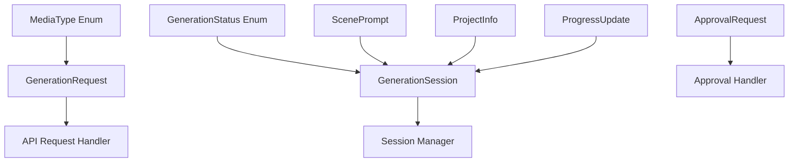

# models.py - Pydantic Data Models

## 📖 Overview

Data models module that defines all data structures used throughout the application using Pydantic. This ensures type safety, data validation, and consistent data handling across all components.

## 🎯 Purpose

- **Type Safety**: Strong typing for all data structures
- **Input Validation**: Automatic validation of API requests and responses
- **Data Serialization**: JSON serialization/deserialization
- **Documentation**: Self-documenting data structures with examples

## 🚀 Key Features

### ✅ **Pydantic Models**
- Automatic validation and type checking
- JSON schema generation
- Serialization to/from JSON, dict
- Field validation with custom validators

### ✅ **Enum Definitions**
- Type-safe enumeration values
- API parameter validation
- Clear option definitions

### ✅ **Nested Models**
- Complex data structures with relationships
- Validation cascades through nested objects
- Clean separation of concerns

## 📊 Model Hierarchy



## 🏗️ Core Models

### Enums

#### `MediaType`
```python
class MediaType(str, Enum):
    """Media style types for image generation"""
    CINEMATIC = "cinematic"    # Movie-like, dramatic lighting
    CARTOON = "cartoon"        # Animated, stylized artwork
    REALISTIC = "realistic"    # Photorealistic imagery
    
    @classmethod
    def get_description(cls, media_type: str) -> str:
        descriptions = {
            cls.CINEMATIC: "Movie-like scenes with dramatic lighting and composition",
            cls.CARTOON: "Animated style with vibrant colors and stylized features", 
            cls.REALISTIC: "Photorealistic images with natural lighting and details"
        }
        return descriptions.get(media_type, "Unknown media type")
```

#### `GenerationStatus`
```python
class GenerationStatus(str, Enum):
    """Generation process status values"""
    PENDING = "pending"           # Request received, not started
    PROCESSING = "processing"     # Generation in progress
    COMPLETED = "completed"       # Successfully completed
    FAILED = "failed"            # Generation failed
    CANCELLED = "cancelled"       # User cancelled
    DOWNLOADING = "downloading"   # Images being downloaded
    
    def is_terminal(self) -> bool:
        """Check if status is terminal (won't change)"""
        return self in [self.COMPLETED, self.FAILED, self.CANCELLED]
    
    def is_active(self) -> bool:
        """Check if status represents active processing"""
        return self in [self.PROCESSING, self.DOWNLOADING]
```

### Request/Response Models

#### `GenerationRequest`
```python
class GenerationRequest(BaseModel):
    """Request to generate images from story"""
    story_text: str = Field(
        ...,
        min_length=10,
        max_length=50000,
        description="Story text to convert to images"
    )
    media_type: MediaType = Field(
        default=MediaType.CINEMATIC,
        description="Visual style for generated images"
    )
    num_scenes: int = Field(
        default=5,
        ge=1,
        le=20,
        description="Number of scenes to generate"
    )
    
    @validator('story_text')
    def validate_story_text(cls, v):
        """Validate story text content"""
        if not v or v.isspace():
            raise ValueError("Story text cannot be empty or whitespace only")
        return v.strip()
    
    class Config:
        schema_extra = {
            "example": {
                "story_text": "A brave knight embarks on a quest to save the kingdom...",
                "media_type": "cinematic", 
                "num_scenes": 5
            }
        }
```

#### `ApprovalRequest`
```python
class ApprovalRequest(BaseModel):
    """Request to approve generated scenes"""
    session_id: str = Field(
        ...,
        description="Session ID from generation request"
    )
    approved_scenes: List[int] = Field(
        ...,
        description="List of scene indices to approve"
    )
    
    @validator('approved_scenes')
    def validate_scene_indices(cls, v):
        """Validate scene indices"""
        if not v:
            raise ValueError("Must approve at least one scene")
        
        if any(idx < 0 for idx in v):
            raise ValueError("Scene indices must be non-negative")
        
        if len(set(v)) != len(v):
            raise ValueError("Scene indices must be unique")
        
        return sorted(v)
    
    class Config:
        schema_extra = {
            "example": {
                "session_id": "123e4567-e89b-12d3-a456-426614174000",
                "approved_scenes": [0, 1, 3]
            }
        }
```

### Core Data Models

#### `ScenePrompt`
```python
class ScenePrompt(BaseModel):
    """Generated scene with prompt and metadata"""
    scene_number: int = Field(..., ge=0, description="Scene sequence number")
    title: str = Field(..., min_length=1, description="Scene title/summary")
    description: str = Field(..., min_length=10, description="Detailed scene description")
    image_prompt: str = Field(..., min_length=10, description="AI image generation prompt")
    image_url: Optional[str] = Field(None, description="Generated image URL")
    image_path: Optional[str] = Field(None, description="Local image file path")
    
    @validator('image_prompt')
    def validate_image_prompt(cls, v):
        """Validate image generation prompt"""
        # Remove potentially problematic content
        forbidden_words = ['explicit', 'nude', 'violence', 'gore']
        if any(word in v.lower() for word in forbidden_words):
            raise ValueError("Image prompt contains inappropriate content")
        return v
    
    def is_generated(self) -> bool:
        """Check if image has been generated"""
        return bool(self.image_url)
    
    def is_downloaded(self) -> bool:
        """Check if image has been downloaded locally"""
        return bool(self.image_path)
    
    class Config:
        schema_extra = {
            "example": {
                "scene_number": 1,
                "title": "Knight's Departure",
                "description": "A brave knight in shining armor stands at the castle gates...",
                "image_prompt": "A medieval knight in silver armor standing at grand castle gates, morning light, cinematic composition",
                "image_url": "https://api.runware.ai/images/generated/knight_scene.jpg",
                "image_path": "/app/images/session_123/scene_1.jpg"
            }
        }
```

#### `ProjectInfo`
```python
class ProjectInfo(BaseModel):
    """Project metadata and file information"""
    project_id: str = Field(..., description="Unique project identifier")
    title: str = Field(..., min_length=1, description="Project title")
    created_at: datetime = Field(default_factory=datetime.utcnow, description="Creation timestamp")
    story_text: str = Field(..., description="Original story text")
    media_type: MediaType = Field(..., description="Selected media type")
    total_scenes: int = Field(..., ge=1, description="Total number of scenes")
    approved_scenes: List[int] = Field(default_factory=list, description="Approved scene indices")
    
    # File paths
    project_dir: str = Field(..., description="Project directory path")
    story_file: Optional[str] = Field(None, description="Story text file path")
    scenes_file: Optional[str] = Field(None, description="Scenes JSON file path")
    
    def get_project_path(self) -> Path:
        """Get project directory as Path object"""
        return Path(self.project_dir)
    
    def get_approved_count(self) -> int:
        """Get number of approved scenes"""
        return len(self.approved_scenes)
    
    class Config:
        schema_extra = {
            "example": {
                "project_id": "proj_123456",
                "title": "The Knight's Quest",
                "story_text": "A brave knight embarks on a quest...",
                "media_type": "cinematic",
                "total_scenes": 5,
                "approved_scenes": [0, 1, 3],
                "project_dir": "/app/images/proj_123456"
            }
        }
```

#### `ProgressUpdate`
```python
class ProgressUpdate(BaseModel):
    """Progress information for ongoing operations"""
    current_step: int = Field(..., ge=0, description="Current processing step")
    total_steps: int = Field(..., ge=1, description="Total steps to complete")
    description: str = Field(..., description="Human-readable progress description")
    percentage: float = Field(None, ge=0, le=100, description="Completion percentage")
    
    @validator('percentage', always=True)
    def calculate_percentage(cls, v, values):
        """Auto-calculate percentage if not provided"""
        if v is None and 'current_step' in values and 'total_steps' in values:
            current = values['current_step']
            total = values['total_steps']
            return round((current / total) * 100, 1) if total > 0 else 0
        return v
    
    @validator('current_step')
    def validate_step_range(cls, v, values):
        """Validate current step is within total steps"""
        if 'total_steps' in values and v > values['total_steps']:
            raise ValueError("Current step cannot exceed total steps")
        return v
    
    class Config:
        schema_extra = {
            "example": {
                "current_step": 3,
                "total_steps": 5, 
                "description": "Generating scene 3 of 5",
                "percentage": 60.0
            }
        }
```

#### `GenerationSession`
```python
class GenerationSession(BaseModel):
    """Complete session data for story generation"""
    session_id: str = Field(..., description="Unique session identifier")
    status: GenerationStatus = Field(default=GenerationStatus.PENDING, description="Current status")
    created_at: datetime = Field(default_factory=datetime.utcnow, description="Session creation time")
    last_accessed: datetime = Field(default_factory=datetime.utcnow, description="Last access time")
    
    # Request data
    request_data: GenerationRequest = Field(..., description="Original generation request")
    
    # Generated content
    scenes: List[ScenePrompt] = Field(default_factory=list, description="Generated scenes")
    project_info: Optional[ProjectInfo] = Field(None, description="Project metadata")
    
    # Progress tracking
    progress: Optional[ProgressUpdate] = Field(None, description="Current progress")
    error_message: Optional[str] = Field(None, description="Error message if failed")
    
    def update_last_accessed(self) -> None:
        """Update last accessed timestamp"""
        self.last_accessed = datetime.utcnow()
    
    def get_age_hours(self) -> float:
        """Get session age in hours"""
        return (datetime.utcnow() - self.created_at).total_seconds() / 3600
    
    def is_expired(self, max_age_hours: int = 24) -> bool:
        """Check if session has expired"""
        return self.get_age_hours() > max_age_hours
    
    def get_scene_by_number(self, scene_number: int) -> Optional[ScenePrompt]:
        """Get scene by its number"""
        for scene in self.scenes:
            if scene.scene_number == scene_number:
                return scene
        return None
    
    def get_completion_percentage(self) -> float:
        """Get overall completion percentage"""
        if not self.scenes:
            return 0.0
        
        if self.status == GenerationStatus.COMPLETED:
            return 100.0
        
        generated_scenes = sum(1 for scene in self.scenes if scene.is_generated())
        total_scenes = len(self.scenes)
        
        return round((generated_scenes / total_scenes) * 100, 1) if total_scenes > 0 else 0.0
    
    class Config:
        schema_extra = {
            "example": {
                "session_id": "123e4567-e89b-12d3-a456-426614174000",
                "status": "processing",
                "request_data": {
                    "story_text": "A brave knight...",
                    "media_type": "cinematic",
                    "num_scenes": 5
                },
                "scenes": [],
                "progress": {
                    "current_step": 2,
                    "total_steps": 5,
                    "description": "Analyzing story structure"
                }
            }
        }
```

## 🛡️ Validation Features

### Custom Validators

#### Text Content Validation
```python
@validator('story_text')
def validate_story_content(cls, v):
    """Comprehensive story text validation"""
    if not v or v.isspace():
        raise ValueError("Story text cannot be empty")
    
    # Check minimum meaningful content
    words = v.strip().split()
    if len(words) < 5:
        raise ValueError("Story must contain at least 5 words")
    
    # Basic content filtering
    inappropriate_patterns = [
        r'\b(explicit|adult|nsfw)\b',
        r'\b(violence|gore|blood)\b',
        r'\b(hate|racist|discrimination)\b'
    ]
    
    import re
    for pattern in inappropriate_patterns:
        if re.search(pattern, v, re.IGNORECASE):
            raise ValueError("Story contains inappropriate content")
    
    return v.strip()
```

#### URL Validation
```python
@validator('image_url')
def validate_image_url(cls, v):
    """Validate image URL format and security"""
    if not v:
        return v
    
    # URL format validation
    url_pattern = r'^https?://[\w\-\.]+/[\w\-\.\/]+\.(jpg|jpeg|png|webp)(\?.*)?
    if not re.match(url_pattern, v, re.IGNORECASE):
        raise ValueError("Invalid image URL format")
    
    # Security check - only allow trusted domains
    trusted_domains = ['api.runware.ai', 'cdn.runware.com', 'storage.googleapis.com']
    from urllib.parse import urlparse
    
    parsed = urlparse(v)
    if parsed.netloc not in trusted_domains:
        raise ValueError(f"Untrusted domain: {parsed.netloc}")
    
    return v
```

### Field Constraints

#### Numeric Ranges
```python
# Scene count constraints
num_scenes: int = Field(
    default=5,
    ge=1,           # Minimum 1 scene
    le=20,          # Maximum 20 scenes
    description="Number of scenes to generate"
)

# Progress percentage
percentage: float = Field(
    None,
    ge=0.0,         # Minimum 0%
    le=100.0,       # Maximum 100%
    description="Completion percentage"
)
```

#### String Length Limits
```python
# Story text limits
story_text: str = Field(
    ...,
    min_length=10,      # Minimum 10 characters
    max_length=50000,   # Maximum 50K characters
    description="Story text to convert"
)

# Title limits
title: str = Field(
    ...,
    min_length=1,       # At least 1 character
    max_length=200,     # Maximum 200 characters
    strip_whitespace=True
)
```

## 🔄 Model Utilities

### Serialization Helpers
```python
class BaseModelMixin:
    """Mixin for enhanced model functionality"""
    
    def to_dict(self, exclude_none: bool = True) -> Dict[str, Any]:
        """Convert to dictionary with options"""
        return self.dict(exclude_none=exclude_none, exclude_unset=True)
    
    def to_json_str(self, **kwargs) -> str:
        """Convert to JSON string"""
        return self.json(**kwargs)
    
    @classmethod
    def from_json_str(cls, json_str: str):
        """Create instance from JSON string"""
        return cls.parse_raw(json_str)
    
    def update_from_dict(self, data: Dict[str, Any]) -> None:
        """Update instance from dictionary"""
        for key, value in data.items():
            if hasattr(self, key):
                setattr(self, key, value)
```

### Model Factory Functions
```python
def create_generation_session(
    request: GenerationRequest,
    session_id: Optional[str] = None
) -> GenerationSession:
    """Factory function to create new generation session"""
    import uuid
    
    if session_id is None:
        session_id = str(uuid.uuid4())
    
    return GenerationSession(
        session_id=session_id,
        status=GenerationStatus.PENDING,
        request_data=request,
        scenes=[],
        progress=ProgressUpdate(
            current_step=0,
            total_steps=request.num_scenes + 2,  # +2 for analysis and finalization
            description="Initializing generation process"
        )
    )

def create_scene_prompt(
    scene_number: int,
    title: str,
    description: str,
    image_prompt: str
) -> ScenePrompt:
    """Factory function to create scene prompt"""
    return ScenePrompt(
        scene_number=scene_number,
        title=title.strip(),
        description=description.strip(),
        image_prompt=image_prompt.strip()
    )
```

## 🧪 Testing Models

### Model Testing Utilities
```python
def create_test_generation_request() -> GenerationRequest:
    """Create test generation request"""
    return GenerationRequest(
        story_text="A brave knight embarks on an epic quest to save the kingdom from an ancient dragon.",
        media_type=MediaType.CINEMATIC,
        num_scenes=3
    )

def create_test_session() -> GenerationSession:
    """Create test session with sample data"""
    request = create_test_generation_request()
    session = create_generation_session(request)
    
    # Add sample scenes
    session.scenes = [
        ScenePrompt(
            scene_number=0,
            title="Knight's Departure",
            description="Knight leaving the castle",
            image_prompt="Medieval knight at castle gates, cinematic lighting"
        ),
        ScenePrompt(
            scene_number=1,
            title="Forest Journey", 
            description="Knight traveling through dark forest",
            image_prompt="Knight on horseback in mystical forest, dramatic shadows"
        )
    ]
    
    return session
```

### Validation Testing
```python
def test_model_validation():
    """Test model validation rules"""
    
    # Test valid request
    valid_request = GenerationRequest(
        story_text="A valid story with enough content to pass validation rules.",
        media_type=MediaType.CARTOON,
        num_scenes=5
    )
    assert valid_request.story_text is not None
    
    # Test invalid requests
    with pytest.raises(ValidationError):
        GenerationRequest(
            story_text="",  # Empty story
            media_type=MediaType.REALISTIC,
            num_scenes=5
        )
    
    with pytest.raises(ValidationError):
        GenerationRequest(
            story_text="Valid story text here",
            media_type=MediaType.CINEMATIC,
            num_scenes=25  # Exceeds maximum
        )
```

## 📚 JSON Schema Generation

### API Documentation
```python
def generate_api_schemas():
    """Generate JSON schemas for API documentation"""
    
    schemas = {
        "GenerationRequest": GenerationRequest.schema(),
        "GenerationSession": GenerationSession.schema(),
        "ApprovalRequest": ApprovalRequest.schema(),
        "ScenePrompt": ScenePrompt.schema(),
        "ProgressUpdate": ProgressUpdate.schema()
    }
    
    # Export for OpenAPI/Swagger
    return schemas

def get_model_examples():
    """Get example data for each model"""
    
    return {
        "generation_request": GenerationRequest.schema()["example"],
        "approval_request": ApprovalRequest.schema()["example"],
        "scene_prompt": ScenePrompt.schema()["example"],
        "progress_update": ProgressUpdate.schema()["example"]
    }
```

---

**models.py provides type-safe, validated, and well-documented data structures that ensure data integrity throughout your application! 📋**