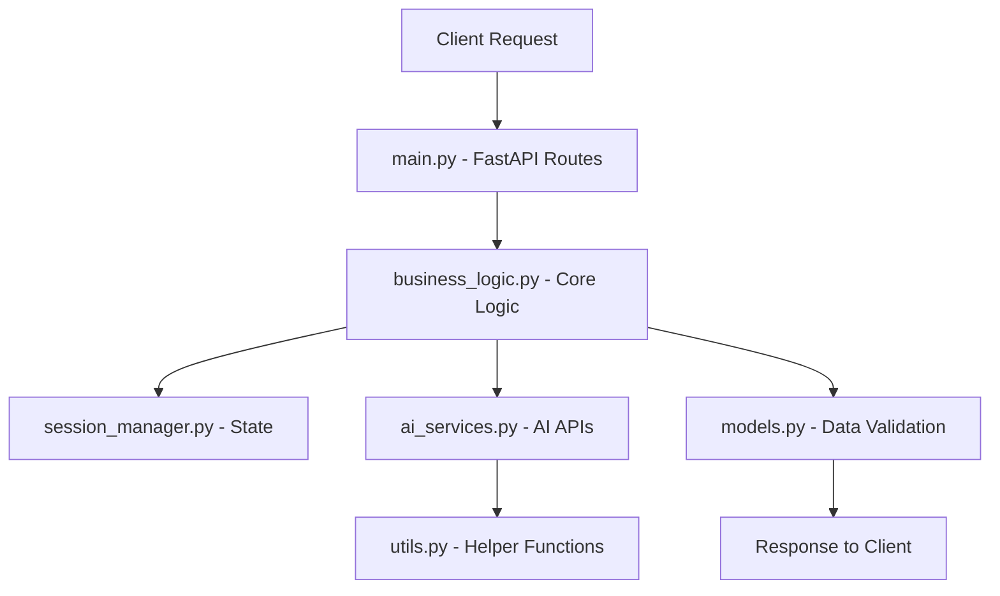

# Story to Image Generator - Backend Documentation

## 🏗️ Architecture Overview

This backend implements a modular, production-ready architecture for converting stories into visual content using AI services. The system is built with FastAPI and follows clean architecture principles.

## 📁 Module Structure

```
backend/
├── main.py                 # 🚀 FastAPI Application Entry Point
├── config.py              # ⚙️ Configuration Management
├── models.py              # 📋 Pydantic Data Models
├── utils.py               # 🔧 Utility Functions
├── ai_services.py         # 🤖 AI Service Integrations
├── session_manager.py     # 📊 Session Management
├── business_logic.py      # 🎯 Core Business Logic
├── test_core_functions.py # ✅ Unit Tests
├── requirements.txt       # 📦 Dependencies
└── .env.example          # 🔐 Environment Template
```

## 🚀 Quick Start

### 1. Install Dependencies
```bash
cd backend
pip install -r requirements.txt
```

### 2. Configure Environment
```bash
cp .env.example .env
# Edit .env with your API keys:
# - OPENROUTER_API_KEY=your_key_here
# - RUNWARE_API_KEY=your_key_here
```

### 3. Run Application
```bash
python main.py
```

### 4. Run Tests
```bash
pip install pytest pytest-asyncio
pytest test_core_functions.py -v
```

## 📚 Module Documentation

| Module | Purpose | Key Features |
|--------|---------|--------------|
| [main.py](docs/main.md) | FastAPI app & routes | CORS, static files, health checks |
| [config.py](docs/config.md) | Environment setup | API keys, paths, validation |
| [models.py](docs/models.md) | Data structures | Pydantic models, enums, validation |
| [utils.py](docs/utils.md) | Helper functions | Script analysis, project management |
| [ai_services.py](docs/ai_services.md) | AI integrations | OpenRouter, Runware APIs |
| [session_manager.py](docs/session_manager.md) | State management | Thread-safe sessions, cleanup |
| [business_logic.py](docs/business_logic.md) | Core workflows | Generation, approval, async ops |

## 🔄 Request Flow



## 🔌 API Endpoints

### Core Generation
- `POST /generate` - Start story generation
- `GET /status/{session_id}` - Check generation status
- `POST /approve` - Approve generated scenes
- `POST /download` - Download generated images

### Management
- `GET /health` - Service health check
- `GET /debug/sessions` - Active sessions (debug)
- `GET /debug/config` - Configuration status (debug)

## 🧪 Testing Strategy

### Unit Tests
- **Script Analysis**: Text parsing, scene extraction
- **Session Management**: CRUD operations, thread safety
- **AI Services**: API integration with mocks
- **Business Logic**: Full workflow testing

### Integration Tests
- End-to-end generation workflows
- Error handling scenarios
- Async operation validation

### Running Tests
```bash
# Run all tests
pytest test_core_functions.py -v

# Run specific test category
pytest test_core_functions.py::test_script_analysis -v
pytest test_core_functions.py::test_session_management -v
pytest test_core_functions.py::test_ai_services -v

# Run with coverage
pytest test_core_functions.py --cov=. --cov-report=html
```

## 🔒 Security Features

- **Environment Variables**: No hardcoded secrets
- **Input Validation**: Pydantic models for all data
- **Error Sanitization**: No sensitive data in error messages
- **CORS Configuration**: Controlled cross-origin access
- **Request Limits**: Built-in FastAPI protections

## 📈 Performance Features

### Async Operations
- **Concurrent Image Generation**: Multiple scenes processed simultaneously
- **Async Downloads**: Non-blocking image downloads
- **Background Tasks**: Long-running operations don't block API

### Session Management
- **Thread-Safe**: Concurrent request handling
- **Memory Efficient**: Automatic cleanup of old sessions
- **Scalable**: Ready for Redis backend

### Caching Ready
- Response caching hooks prepared
- Static file serving optimized
- Database query optimization ready

## 🐛 Debugging

### Debug Endpoints
```bash
# Check service health
curl http://localhost:8000/health

# View active sessions
curl http://localhost:8000/debug/sessions

# Check configuration
curl http://localhost:8000/debug/config
```

### Logging
- **Structured Logging**: JSON format ready
- **Log Levels**: DEBUG, INFO, WARNING, ERROR
- **Request Tracing**: Session ID tracking
- **Performance Metrics**: Response time logging

## 🚀 Deployment Ready

### Environment Support
- **Development**: Auto-reload, debug endpoints
- **Staging**: Performance monitoring, test data
- **Production**: Security hardened, monitoring integrated

### Scaling Options
- **Horizontal**: Multiple FastAPI instances
- **Vertical**: Async operations, efficient memory usage
- **Database**: Ready for PostgreSQL/Redis integration
- **Containerization**: Docker-ready structure

## 📊 Monitoring Hooks

The codebase includes hooks for:
- **Health Checks**: `/health` endpoint with detailed status
- **Metrics Collection**: Request counting, response times
- **Error Tracking**: Structured error logging
- **Performance Monitoring**: Async operation timing

## 🔧 Configuration Options

### Environment Variables
```bash
# Required
OPENROUTER_API_KEY=sk-...        # OpenRouter API for text generation
RUNWARE_API_KEY=your-key         # Runware API for image generation

# Optional
LOG_LEVEL=INFO                   # Logging level (DEBUG/INFO/WARNING/ERROR)
MAX_SESSIONS=100                 # Maximum concurrent sessions
SESSION_CLEANUP_HOURS=24         # Hours before session cleanup
CORS_ORIGINS=*                   # CORS allowed origins
```

### Runtime Configuration
- **Model Selection**: Easy switching between AI models
- **Timeout Values**: Configurable API timeouts
- **Retry Logic**: Customizable retry attempts
- **Rate Limits**: Request throttling configuration

## 🎯 Next Steps

1. **Redis Integration**: Persistent session storage
2. **Database Layer**: PostgreSQL for data persistence
3. **Monitoring**: Prometheus metrics, Grafana dashboards
4. **CI/CD Pipeline**: Automated testing and deployment
5. **Docker Containers**: Containerized deployment
6. **Load Balancing**: Multiple instance support

---

**Your modular backend is ready for production deployment! 🎉**

Each module is documented, tested, and follows Python best practices. The architecture supports team development and scales from development to enterprise deployment.