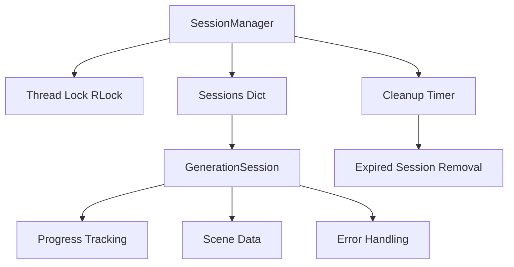

# session_manager.py - Session Management

## 📖 Overview

Thread-safe session management module that handles user sessions, tracks generation progress, and manages session lifecycle. This module ensures data consistency across concurrent requests and provides automatic cleanup of expired sessions.

## 🎯 Purpose

- **Session Storage**: Thread-safe storage and retrieval of user sessions
- **Progress Tracking**: Monitor and update generation progress in real-time
- **Memory Management**: Automatic cleanup of expired sessions
- **Concurrent Access**: Handle multiple simultaneous requests safely

## 🚀 Key Features

### ✅ **Thread-Safe Operations**
- Reentrant locks (RLock) for nested lock acquisition
- Atomic operations for session updates
- Safe concurrent access from multiple threads
- Deadlock prevention mechanisms

### ✅ **Automatic Cleanup**
- Background cleanup of expired sessions
- Configurable session lifetime
- Memory usage monitoring
- Graceful shutdown handling

### ✅ **Progress Tracking**
- Real-time progress updates
- Step-by-step generation tracking
- Error state management
- Completion notifications

## 🏗️ Architecture

### Session Manager Structure



### Core Components

#### `SessionManager`
```python
class SessionManager:
    """Thread-safe session manager for handling user sessions"""
    
    def __init__(self, max_sessions: int = 100, cleanup_interval: int = 3600):
        self.sessions: Dict[str, GenerationSession] = {}
        self.lock = threading.RLock()  # Reentrant lock for nested acquisitions
        self.max_sessions = max_sessions
        self.cleanup_interval = cleanup_interval
        
        # Start cleanup timer
        self._cleanup_timer = None
        self._shutdown_event = threading.Event()
        self._start_cleanup_timer()
        
        logger.info(f"✅ SessionManager initialized (max_sessions: {max_sessions})")
    
    def create_session(self, request: GenerationRequest) -> str:
        """Create new generation session"""
        
        with self.lock:
            # Generate unique session ID
            session_id = str(uuid.uuid4())
            
            # Check if we're at capacity
            if len(self.sessions) >= self.max_sessions:
                self._cleanup_expired_sessions()
                
                # Still at capacity? Remove oldest session
                if len(self.sessions) >= self.max_sessions:
                    self._remove_oldest_session()
            
            # Create new session
            session = GenerationSession(
                session_id=session_id,
                status=GenerationStatus.PENDING,
                request_data=request,
                created_at=datetime.utcnow(),
                last_accessed=datetime.utcnow()
            )
            
            self.sessions[session_id] = session
            
            logger.info(f"✅ Created session {session_id} ({len(self.sessions)} total)")
            return session_id
    
    def get_session(self, session_id: str) -> Optional[GenerationSession]:
        """Get session by ID with automatic access time update"""
        
        with self.lock:
            session = self.sessions.get(session_id)
            if session:
                # Update last accessed time
                session.last_accessed = datetime.utcnow()
                logger.debug(f"📊 Accessed session {session_id}")
            else:
                logger.warning(f"⚠️ Session not found: {session_id}")
            
            return session
    
    def update_session_status(
        self, 
        session_id: str, 
        status: GenerationStatus,
        error_message: Optional[str] = None
    ) -> bool:
        """Update session status atomically"""
        
        with self.lock:
            session = self.sessions.get(session_id)
            if not session:
                logger.warning(f"⚠️ Cannot update non-existent session: {session_id}")
                return False
            
            old_status = session.status
            session.status = status
            session.last_accessed = datetime.utcnow()
            
            if error_message:
                session.error_message = error_message
            
            logger.info(f"📊 Session {session_id} status: {old_status} → {status}")
            return True
    
    def update_session_progress(
        self, 
        session_id: str, 
        current_step: int,
        total_steps: int,
        description: str
    ) -> bool:
        """Update session progress information"""
        
        with self.lock:
            session = self.sessions.get(session_id)
            if not session:
                return False
            
            # Create or update progress
            session.progress = ProgressUpdate(
                current_step=current_step,
                total_steps=total_steps,
                description=description
            )
            session.last_accessed = datetime.utcnow()
            
            percentage = session.progress.percentage
            logger.info(f"📈 Session {session_id} progress: {current_step}/{total_steps} ({percentage}%)")
            return True
    
    def add_scene_to_session(self, session_id: str, scene: ScenePrompt) -> bool:
        """Add generated scene to session"""
        
        with self.lock:
            session = self.sessions.get(session_id)
            if not session:
                return False
            
            # Add or update scene
            existing_scene_idx = None
            for i, existing_scene in enumerate(session.scenes):
                if existing_scene.scene_number == scene.scene_number:
                    existing_scene_idx = i
                    break
            
            if existing_scene_idx is not None:
                session.scenes[existing_scene_idx] = scene
                logger.info(f"📝 Updated scene {scene.scene_number} in session {session_id}")
            else:
                session.scenes.append(scene)
                logger.info(f"📝 Added scene {scene.scene_number} to session {session_id}")
            
            session.last_accessed = datetime.utcnow()
            return True
    
    def set_session_scenes(self, session_id: str, scenes: List[ScenePrompt]) -> bool:
        """Set all scenes for a session at once"""
        
        with self.lock:
            session = self.sessions.get(session_id)
            if not session:
                return False
            
            session.scenes = scenes.copy()
            session.last_accessed = datetime.utcnow()
            
            logger.info(f"📝 Set {len(scenes)} scenes for session {session_id}")
            return True
    
    def remove_session(self, session_id: str) -> bool:
        """Remove session from manager"""
        
        with self.lock:
            if session_id in self.sessions:
                del self.sessions[session_id]
                logger.info(f"🗑️ Removed session {session_id} ({len(self.sessions)} remaining)")
                return True
            else:
                logger.warning(f"⚠️ Cannot remove non-existent session: {session_id}")
                return False
    
    def get_session_count(self) -> int:
        """Get current number of active sessions"""
        with self.lock:
            return len(self.sessions)
    
    def get_all_sessions_info(self) -> List[Dict[str, Any]]:
        """Get summary information for all sessions"""
        
        with self.lock:
            sessions_info = []
            for session_id, session in self.sessions.items():
                info = {
                    "session_id": session_id,
                    "status": session.status.value,
                    "created_at": session.created_at.isoformat(),
                    "last_accessed": session.last_accessed.isoformat(),
                    "age_hours": session.get_age_hours(),
                    "num_scenes": len(session.scenes),
                    "progress": session.progress.dict() if session.progress else None
                }
                sessions_info.append(info)
            
            return sessions_info
```

## 🧹 Cleanup Operations

### Automatic Session Cleanup
```python
    def _start_cleanup_timer(self) -> None:
        """Start the cleanup timer for expired sessions"""
        
        def cleanup_worker():
            while not self._shutdown_event.wait(self.cleanup_interval):
                try:
                    self._cleanup_expired_sessions()
                    self._log_memory_usage()
                except Exception as e:
                    logger.error(f"❌ Cleanup worker error: {e}")
        
        self._cleanup_timer = threading.Thread(
            target=cleanup_worker,
            name="SessionCleanup",
            daemon=True
        )
        self._cleanup_timer.start()
        logger.info("🧹 Session cleanup timer started")
    
    def _cleanup_expired_sessions(self, max_age_hours: int = 24) -> int:
        """Remove expired sessions and return count removed"""
        
        with self.lock:
            current_time = datetime.utcnow()
            expired_sessions = []
            
            for session_id, session in self.sessions.items():
                age_hours = (current_time - session.created_at).total_seconds() / 3600
                
                # Mark as expired if:
                # 1. Older than max age
                # 2. Failed and older than 1 hour
                # 3. Completed and older than 6 hours
                should_expire = (
                    age_hours > max_age_hours or
                    (session.status == GenerationStatus.FAILED and age_hours > 1) or
                    (session.status == GenerationStatus.COMPLETED and age_hours > 6)
                )
                
                if should_expire:
                    expired_sessions.append(session_id)
            
            # Remove expired sessions
            for session_id in expired_sessions:
                del self.sessions[session_id]
            
            if expired_sessions:
                logger.info(f"🧹 Cleaned up {len(expired_sessions)} expired sessions")
            
            return len(expired_sessions)
    
    def _remove_oldest_session(self) -> bool:
        """Remove the oldest session to free up space"""
        
        with self.lock:
            if not self.sessions:
                return False
            
            # Find oldest session by creation time
            oldest_session_id = min(
                self.sessions.keys(),
                key=lambda sid: self.sessions[sid].created_at
            )
            
            del self.sessions[oldest_session_id]
            logger.warning(f"⚠️ Removed oldest session {oldest_session_id} (capacity limit)")
            return True
    
    def _log_memory_usage(self) -> None:
        """Log current memory usage and session statistics"""
        
        with self.lock:
            session_count = len(self.sessions)
            
            # Count sessions by status
            status_counts = {}
            for session in self.sessions.values():
                status = session.status.value
                status_counts[status] = status_counts.get(status, 0) + 1
            
            # Calculate average age
            if session_count > 0:
                total_age = sum(s.get_age_hours() for s in self.sessions.values())
                avg_age = total_age / session_count
            else:
                avg_age = 0
            
            logger.info(
                f"📊 Sessions: {session_count}/{self.max_sessions} "
                f"(avg age: {avg_age:.1f}h) Status: {status_counts}"
            )
```

### Manual Cleanup Operations
```python
    def cleanup_failed_sessions(self) -> int:
        """Remove all failed sessions"""
        
        with self.lock:
            failed_sessions = [
                sid for sid, session in self.sessions.items()
                if session.status == GenerationStatus.FAILED
            ]
            
            for session_id in failed_sessions:
                del self.sessions[session_id]
            
            if failed_sessions:
                logger.info(f"🧹 Removed {len(failed_sessions)} failed sessions")
            
            return len(failed_sessions)
    
    def cleanup_completed_sessions(self, max_age_hours: int = 6) -> int:
        """Remove old completed sessions"""
        
        with self.lock:
            current_time = datetime.utcnow()
            old_completed = []
            
            for session_id, session in self.sessions.items():
                if (session.status == GenerationStatus.COMPLETED and
                    session.get_age_hours() > max_age_hours):
                    old_completed.append(session_id)
            
            for session_id in old_completed:
                del self.sessions[session_id]
            
            if old_completed:
                logger.info(f"🧹 Removed {len(old_completed)} old completed sessions")
            
            return len(old_completed)
    
    def force_cleanup_all(self) -> int:
        """Remove all sessions (emergency cleanup)"""
        
        with self.lock:
            session_count = len(self.sessions)
            self.sessions.clear()
            
            logger.warning(f"⚠️ Force removed all {session_count} sessions")
            return session_count
```

## 🔒 Thread Safety Features

### Lock Management
```python
    def with_session_lock(self, session_id: str, operation: Callable) -> Any:
        """Execute operation with session-specific locking"""
        
        with self.lock:
            session = self.sessions.get(session_id)
            if not session:
                raise ValueError(f"Session not found: {session_id}")
            
            try:
                return operation(session)
            except Exception as e:
                logger.error(f"❌ Operation failed for session {session_id}: {e}")
                raise
    
    def atomic_session_update(
        self, 
        session_id: str, 
        updates: Dict[str, Any]
    ) -> bool:
        """Atomically update multiple session properties"""
        
        with self.lock:
            session = self.sessions.get(session_id)
            if not session:
                return False
            
            # Apply all updates atomically
            for key, value in updates.items():
                if hasattr(session, key):
                    setattr(session, key, value)
                else:
                    logger.warning(f"⚠️ Unknown session attribute: {key}")
            
            # Always update last accessed time
            session.last_accessed = datetime.utcnow()
            
            logger.info(f"📊 Atomic update for session {session_id}: {list(updates.keys())}")
            return True
```

### Concurrent Access Patterns
```python
    def bulk_update_sessions(
        self, 
        session_ids: List[str], 
        operation: Callable[[GenerationSession], None]
    ) -> int:
        """Apply operation to multiple sessions atomically"""
        
        with self.lock:
            successful_updates = 0
            
            for session_id in session_ids:
                session = self.sessions.get(session_id)
                if session:
                    try:
                        operation(session)
                        session.last_accessed = datetime.utcnow()
                        successful_updates += 1
                    except Exception as e:
                        logger.error(f"❌ Bulk update failed for {session_id}: {e}")
            
            logger.info(f"📊 Bulk updated {successful_updates}/{len(session_ids)} sessions")
            return successful_updates
    
    def get_sessions_by_status(self, status: GenerationStatus) -> List[GenerationSession]:
        """Get all sessions with specific status"""
        
        with self.lock:
            matching_sessions = []
            for session in self.sessions.values():
                if session.status == status:
                    # Create a copy to avoid modification outside lock
                    session_copy = GenerationSession(**session.dict())
                    matching_sessions.append(session_copy)
            
            return matching_sessions
```

## 📊 Session Statistics & Monitoring

### Performance Metrics
```python
    def get_performance_stats(self) -> Dict[str, Any]:
        """Get detailed performance statistics"""
        
        with self.lock:
            current_time = datetime.utcnow()
            stats = {
                "total_sessions": len(self.sessions),
                "max_capacity": self.max_sessions,
                "utilization_percent": (len(self.sessions) / self.max_sessions) * 100,
                "status_breakdown": {},
                "age_distribution": {
                    "under_1h": 0,
                    "1h_to_6h": 0,
                    "6h_to_24h": 0,
                    "over_24h": 0
                },
                "average_age_hours": 0,
                "oldest_session_hours": 0,
                "newest_session_hours": 0
            }
            
            if not self.sessions:
                return stats
            
            # Calculate status breakdown
            for session in self.sessions.values():
                status = session.status.value
                stats["status_breakdown"][status] = stats["status_breakdown"].get(status, 0) + 1
            
            # Calculate age distribution and averages
            ages = []
            for session in self.sessions.values():
                age_hours = session.get_age_hours()
                ages.append(age_hours)
                
                # Age distribution buckets
                if age_hours < 1:
                    stats["age_distribution"]["under_1h"] += 1
                elif age_hours < 6:
                    stats["age_distribution"]["1h_to_6h"] += 1
                elif age_hours < 24:
                    stats["age_distribution"]["6h_to_24h"] += 1
                else:
                    stats["age_distribution"]["over_24h"] += 1
            
            # Age statistics
            stats["average_age_hours"] = round(sum(ages) / len(ages), 2)
            stats["oldest_session_hours"] = round(max(ages), 2)
            stats["newest_session_hours"] = round(min(ages), 2)
            
            return stats
    
    def get_health_status(self) -> Dict[str, str]:
        """Get health status of session manager"""
        
        with self.lock:
            session_count = len(self.sessions)
            utilization = (session_count / self.max_sessions) * 100
            
            # Determine overall health
            if utilization < 70:
                health = "healthy"
            elif utilization < 90:
                health = "warning"
            else:
                health = "critical"
            
            # Check for stuck sessions (processing for too long)
            stuck_sessions = 0
            current_time = datetime.utcnow()
            
            for session in self.sessions.values():
                if (session.status == GenerationStatus.PROCESSING and
                    (current_time - session.last_accessed).total_seconds() > 1800):  # 30 minutes
                    stuck_sessions += 1
            
            return {
                "overall_health": health,
                "session_count": str(session_count),
                "utilization_percent": f"{utilization:.1f}%",
                "stuck_sessions": str(stuck_sessions),
                "cleanup_active": "yes" if self._cleanup_timer and self._cleanup_timer.is_alive() else "no"
            }
```

### Monitoring Hooks
```python
    def register_session_callback(
        self, 
        event_type: str, 
        callback: Callable[[str, GenerationSession], None]
    ) -> None:
        """Register callback for session events"""
        
        if not hasattr(self, '_callbacks'):
            self._callbacks = {}
        
        if event_type not in self._callbacks:
            self._callbacks[event_type] = []
        
        self._callbacks[event_type].append(callback)
        logger.info(f"📋 Registered callback for {event_type} events")
    
    def _trigger_callbacks(self, event_type: str, session_id: str, session: GenerationSession) -> None:
        """Trigger registered callbacks for session events"""
        
        if hasattr(self, '_callbacks') and event_type in self._callbacks:
            for callback in self._callbacks[event_type]:
                try:
                    callback(session_id, session)
                except Exception as e:
                    logger.error(f"❌ Callback error for {event_type}: {e}")
```

## 🔧 Configuration & Lifecycle

### Initialization Options
```python
    @classmethod
    def create_with_config(cls, config: Dict[str, Any]) -> 'SessionManager':
        """Create session manager with custom configuration"""
        
        return cls(
            max_sessions=config.get('max_sessions', 100),
            cleanup_interval=config.get('cleanup_interval', 3600)
        )
    
    def reconfigure(
        self, 
        max_sessions: Optional[int] = None,
        cleanup_interval: Optional[int] = None
    ) -> None:
        """Reconfigure session manager parameters"""
        
        with self.lock:
            if max_sessions is not None:
                old_max = self.max_sessions
                self.max_sessions = max_sessions
                logger.info(f"📊 Max sessions: {old_max} → {max_sessions}")
                
                # If reduced, trigger cleanup
                if max_sessions < old_max:
                    self._cleanup_expired_sessions()
            
            if cleanup_interval is not None:
                old_interval = self.cleanup_interval
                self.cleanup_interval = cleanup_interval
                logger.info(f"⏰ Cleanup interval: {old_interval}s → {cleanup_interval}s")
```

### Graceful Shutdown
```python
    def shutdown(self, timeout: int = 30) -> bool:
        """Gracefully shutdown session manager"""
        
        logger.info("🔄 Initiating session manager shutdown...")
        
        # Signal cleanup thread to stop
        self._shutdown_event.set()
        
        # Wait for cleanup thread to finish
        if self._cleanup_timer and self._cleanup_timer.is_alive():
            self._cleanup_timer.join(timeout=timeout)
            
            if self._cleanup_timer.is_alive():
                logger.warning("⚠️ Cleanup thread did not stop gracefully")
                return False
        
        # Final cleanup
        with self.lock:
            active_sessions = len(self.sessions)
            
            # Save active sessions (optional - for persistence)
            if active_sessions > 0:
                logger.info(f"💾 {active_sessions} active sessions during shutdown")
            
            # Clear all sessions
            self.sessions.clear()
        
        logger.info("✅ Session manager shutdown complete")
        return True
    
    def __enter__(self):
        """Context manager entry"""
        return self
    
    def __exit__(self, exc_type, exc_val, exc_tb):
        """Context manager exit with cleanup"""
        self.shutdown()

# Global session manager instance
session_manager = SessionManager(
    max_sessions=config.max_sessions,
    cleanup_interval=config.session_cleanup_hours * 3600
)
```

## 🧪 Testing Support

### Test Utilities
```python
def create_test_session_manager(max_sessions: int = 5) -> SessionManager:
    """Create session manager configured for testing"""
    
    return SessionManager(
        max_sessions=max_sessions,
        cleanup_interval=60  # Short cleanup interval for testing
    )

def create_mock_session(
    session_id: str = None,
    status: GenerationStatus = GenerationStatus.PENDING
) -> GenerationSession:
    """Create mock session for testing"""
    
    if session_id is None:
        session_id = f"test_session_{int(time.time())}"
    
    return GenerationSession(
        session_id=session_id,
        status=status,
        request_data=GenerationRequest(
            story_text="Test story for session",
            media_type=MediaType.CINEMATIC,
            num_scenes=3
        ),
        scenes=[],
        created_at=datetime.utcnow(),
        last_accessed=datetime.utcnow()
    )

def wait_for_cleanup(session_manager: SessionManager, max_wait: int = 10) -> bool:
    """Wait for cleanup to complete (testing utility)"""
    
    import time
    
    start_time = time.time()
    while time.time() - start_time < max_wait:
        if session_manager._cleanup_timer.is_alive():
            time.sleep(0.1)
        else:
            return True
    
    return False
```

## 📊 Error Handling

### Custom Exceptions
```python
class SessionManagerError(Exception):
    """Base exception for session manager errors"""
    pass

class SessionNotFoundError(SessionManagerError):
    """Exception when session is not found"""
    pass

class SessionCapacityError(SessionManagerError):
    """Exception when session capacity is exceeded"""
    pass

class SessionLockError(SessionManagerError):
    """Exception for lock acquisition failures"""
    pass
```

### Error Recovery
```python
    def recover_corrupted_session(self, session_id: str) -> bool:
        """Attempt to recover a corrupted session"""
        
        with self.lock:
            session = self.sessions.get(session_id)
            if not session:
                return False
            
            try:
                # Reset session to a safe state
                session.status = GenerationStatus.FAILED
                session.error_message = "Session recovered from corrupted state"
                session.last_accessed = datetime.utcnow()
                
                logger.info(f"🔄 Recovered corrupted session {session_id}")
                return True
                
            except Exception as e:
                logger.error(f"❌ Failed to recover session {session_id}: {e}")
                # Remove unrecoverable session
                del self.sessions[session_id]
                return False
```

---

**session_manager.py provides robust, thread-safe session management with automatic cleanup, comprehensive monitoring, and production-ready reliability! 📊**